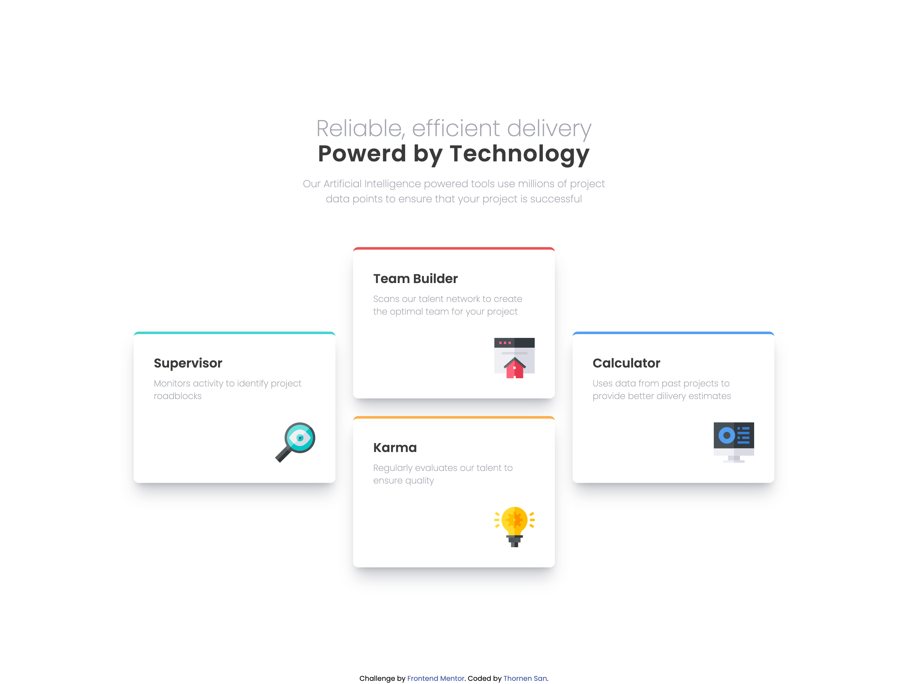
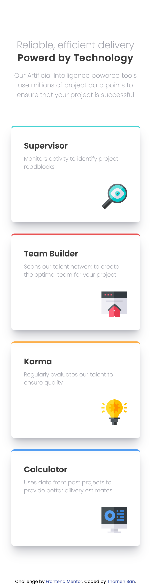

# Frontend Mentor - Four card feature section solution

This is a solution to the [Four card feature section challenge on Frontend Mentor](https://www.frontendmentor.io/challenges/four-card-feature-section-weK1eFYK). Frontend Mentor challenges help you improve your coding skills by building realistic projects.

## Table of contents

- [Overview](#overview)
  - [The challenge](#the-challenge)
  - [Screenshot](#screenshot)
  - [Links](#links)
- [My process](#my-process)
  - [Built with](#built-with)
  - [Useful resources](#useful-resources)
- [Author](#author)

## Overview

### The challenge

Users should be able to:

- View the optimal layout for the site depending on their device's screen size

### Screenshot

### Links

- Solution URL: [Solution Url](https://github.com/ThornenSan/Frontend-Mentor-Four-Card-Feature-Section.git)
- Live Site URL: [Live Site Url](https://thornensan.github.io/Frontend-Mentor-Four-Card-Feature-Section)

## My process

### Built with

- Semantic HTML5 markup
- CSS custom properties
- Flexbox
- Mobile-first workflow
- Tailwind CSS

## Author

- Website - [Thornen San](https://thornensan.netlify.app)
- Frontend Mentor - [@ThornenSan](https://www.frontendmentor.io/profile/ThornenSan)
